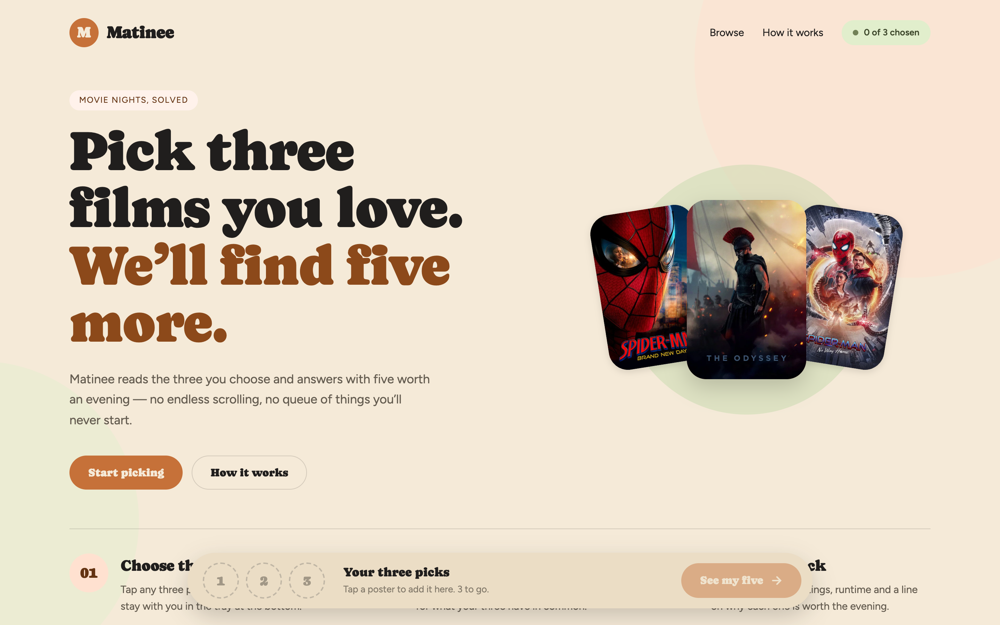
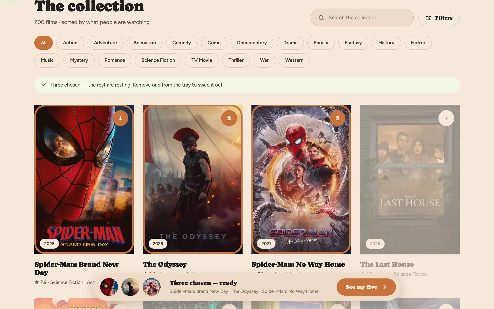
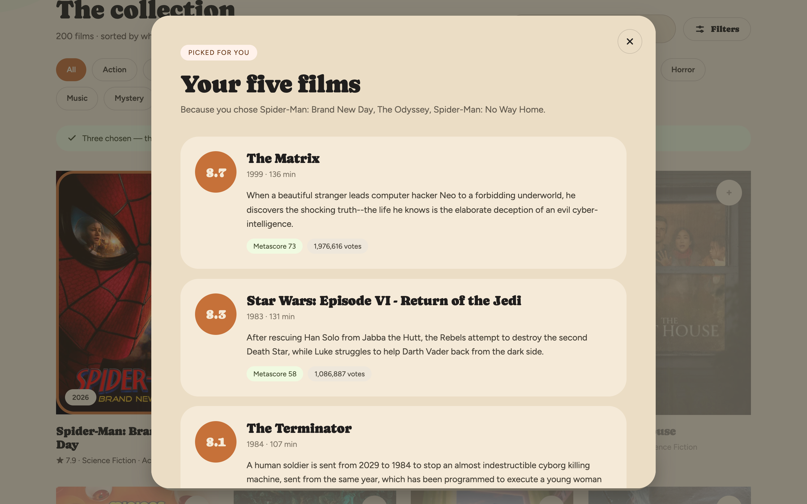
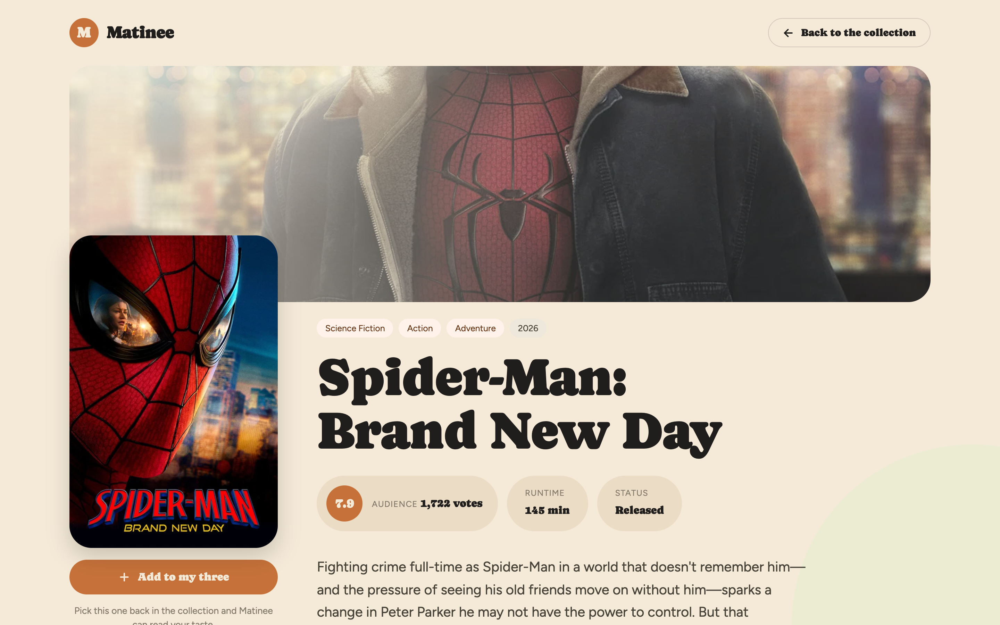
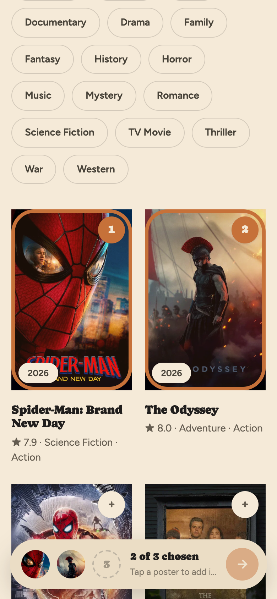
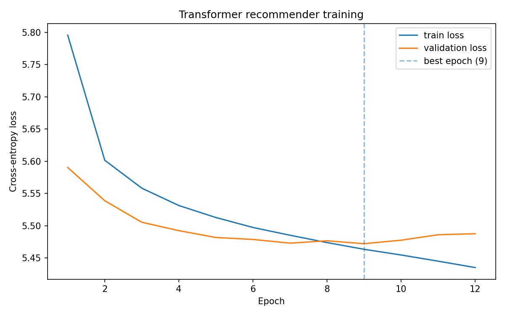

# Movie-Recommendation

A web app for a movie recommendation system that fetches detailed movie information from TMDb for the front-end, ensuring up-to-date and rich metadata. For the backend, IMDb data is utilized to train a custom transformer deep learning model, leveraging user ratings and reviews to provide highly accurate and personalized recommendations. This approach combines real-time data fetching with advanced deep learning techniques to enhance user experience and movie discovery.

## Home
<p align="center">
    
</p>

## Pick Three Films
<p align="center">
    
</p>

## Get Five Back
<p align="center">
    
</p>

## Movie Detail
<p align="center">
    
</p>

<p align="center">
    
</p>

## Steps to Run:

1. **Navigate to the directory that you cloned the project into**:
    ```sh
    cd /path/to/your/Movie-Recommendation
    ```

2. **Install dependencies**:
    ```sh
    pip install -r requirements.txt
    ```

3. **Configure your TMDB API key**:
    ```sh
    cp .env.example .env
    ```
    Then edit `.env` and fill in your own TMDB API key (get one at https://www.themoviedb.org/settings/api).

4. **Run the Flask application**:
    ```sh
    python python/app.py
    ```

5. Open your web browser and go to `http://127.0.0.1:5001/`.
   (Port 5001 avoids macOS AirPlay Receiver, which occupies port 5000. Override with `PORT=...`.)

## Training

The repo ships with a trained Transformer checkpoint (`models/transformer.pt`) that powers
the `/recommend` endpoint. To retrain it yourself:

1. **Rebuild the ratings data** (real ratings from the [MovieLens ml-latest-small](https://grouplens.org/datasets/movielens/latest/) dataset,
   mapped onto the Top-1000 IMDb movies by title):
    ```sh
    curl -LO https://files.grouplens.org/datasets/movielens/ml-latest-small.zip
    unzip ml-latest-small.zip
    python python/data.py ./ml-latest-small
    ```

2. **Train the model**. For a quick run (a couple of minutes) train on the small dataset:
    ```sh
    python python/train.py
    ```
    The shipped checkpoint was trained on the full [MovieLens 25M](https://grouplens.org/datasets/movielens/25m/)
    dataset (162k users, 8.3M ratings on the matched movies; ~45 minutes on an M1 Pro via MPS):
    ```sh
    curl -LO https://files.grouplens.org/datasets/movielens/ml-25m.zip
    unzip ml-25m.zip
    python python/train.py ./ml-25m
    ```
    This saves the checkpoint to `models/transformer.pt` and the loss curve to
    `images/training_loss.png`.

The task mirrors inference exactly: given the token sequence of 3 movies a user rated >= 4.0
(each movie represented as its title plus genre words), predict another movie the same user
liked. Validation is split by user, so the model is evaluated on users it has never seen.
The shipped checkpoint reaches **hit@5 = 10.0%** on held-out users, vs **7.7%** for a
popularity baseline that always recommends the 5 most-liked movies. If the checkpoint is
missing, the app falls back to an SVD collaborative-filtering model trained on the same ratings.

<p align="center">
    
</p>

## Reference:
[Attention is All You Need](https://arxiv.org/abs/1706.03762)

[IMDb Dataset](https://www.kaggle.com/datasets/ashirwadsangwan/imdb-dataset?)

[TMDB API](https://developer.themoviedb.org/reference/intro/getting-started)

[MovieLens Dataset](https://grouplens.org/datasets/movielens/latest/) — F. Maxwell Harper and Joseph A. Konstan. 2015. The MovieLens Datasets: History and Context. ACM TiiS 5, 4.
